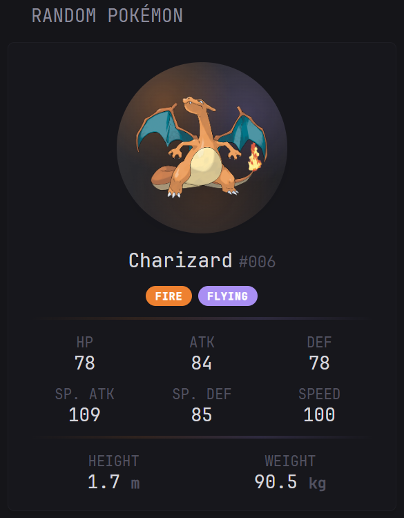
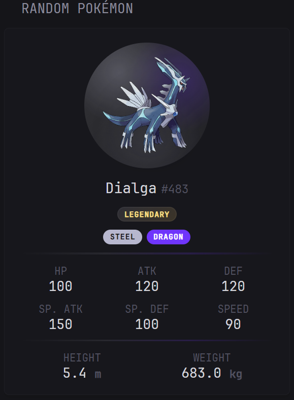
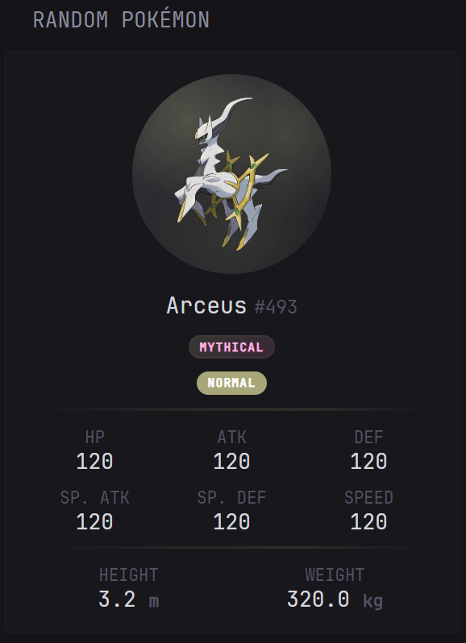
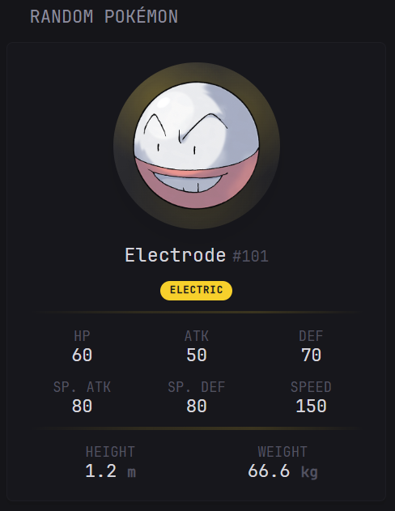

<h1 align="center">glance-pokemon</h1>

<p align="center">
  <strong>A Glance widget that surfaces a random Pokémon with type-aware styling, stats, and species badges.</strong>
</p>

<p align="center">
  <a href="https://github.com/glanceapp/glance"></a>
  <a href="https://pokeapi.co"></a>
  <a href="https://randomnumberapi.com"></a>
  
  
</p>

<p align="center">
  <a href="#overview">Overview</a> •
  <a href="#quick-start">Quick Start</a> •
  <a href="#widget-options">Widget Options</a> •
  <a href="#widget-details">Widget Details</a> •
  <a href="#references">References</a>
</p>

<table align="center" border="0">
  <tr>
    <td align="center"></td>
    <td align="center"></td>
    <td align="center"></td>
  </tr>
  <tr>
    <td align="center"><sub><em>Normal</em></sub></td>
    <td align="center"><sub><em>Legendary</em></sub></td>
    <td align="center"><sub><em>Mythical</em></sub></td>
  </tr>
</table>

---

## Overview

| Widget | Purpose | Best Fit | File |
|---|---|---|---|
| Random Pokemon | Show a random Pokemon with official artwork, type chips, base stats, height, weight, and optional legendary or mythical badges | `small` | `widgets/random-pokemon.yml` |

The widget is designed for a compact sidebar-style Glance placement and renders directly from public APIs without any additional backend or local service:

- random Pokemon selection through `randomnumberapi.com`
- Pokemon data and artwork from [PokeAPI](https://pokeapi.co)
- type-aware gradient accents around the artwork
- built-in fallbacks for random ID errors, Pokemon lookup errors, and missing artwork

### Data Flow

1. Glance requests a random Pokemon ID from `randomnumberapi.com`.
2. The widget loads the Pokemon record from `https://pokeapi.co/api/v2/pokemon/<id>`.
3. It loads the species record from `https://pokeapi.co/api/v2/pokemon-species/<id>`.
4. The template renders artwork, type colors, stats, physical attributes, and optional `Legendary` or `Mythical` badges.

---

## Quick Start

1. Copy `widgets/random-pokemon.yml` into your Glance `widgets/` folder.
2. Include the widget in `glance.yml`.
3. Reload Glance.

No environment variables are required.

```yaml
pages:
  - name: Fun
    columns:
      - size: small
        widgets:
          - $include: widgets/random-pokemon.yml
            options:
              min-id: 1
              max-id: 151
```

Reference config: `examples/glance.yml`

---

## Widget Options

### Random Pokemon (`widgets/random-pokemon.yml`)

| Option | Type | Default | Description |
|---|---|---|---|
| `min-id` | int | `1` | Lowest Pokedex number allowed for the random selection |
| `max-id` | int | `1025` | Highest Pokedex number allowed for the random selection |

Behavior notes:

- the widget clamps values to the supported national Pokedex range of `1-1025`
- if `min-id` is greater than `max-id`, the widget swaps them automatically
- this makes `Gen 1 only`, `Gen 1-4`, or `Gen 4 only` setups possible without editing the template

### Generation Ranges

| Generation | Pokedex Range |
|---|---|
| Gen 1 | `1-151` |
| Gen 2 | `152-251` |
| Gen 3 | `252-386` |
| Gen 4 | `387-493` |
| Gen 5 | `494-649` |
| Gen 6 | `650-721` |
| Gen 7 | `722-809` |
| Gen 8 | `810-905` |
| Gen 9 | `906-1025` |

### Example Ranges

**Gen 1 only**

```yaml
- $include: widgets/random-pokemon.yml
  options:
    min-id: 1
    max-id: 151
```

**Gen 1-4**

```yaml
- $include: widgets/random-pokemon.yml
  options:
    min-id: 1
    max-id: 493
```

**Gen 4 only**

```yaml
- $include: widgets/random-pokemon.yml
  options:
    min-id: 387
    max-id: 493
```

---

## Widget Details

### Random Pokemon (`widgets/random-pokemon.yml`)

<p align="center">
  
</p>

```yaml
- type: custom-api
  title: Random Pokemon
  cache: 5m
  options:
    min-id: 1
    max-id: 1025
  template: |
    # Random ID lookup within the configured range, Pokemon data requests,
    # species lookup, and rendering are handled inside the template
    ...
```

### Behavior Notes

- the widget is tuned for a `small` Glance column
- each refresh selects a new random Pokemon and caches the result for `5m`
- the selection range can be limited with `min-id` and `max-id`
- the artwork circle, divider accents, and artwork shadow adapt to the Pokemon type palette
- dual-type Pokemon blend primary and secondary type colors in the accent treatment
- species data adds `Legendary` and `Mythical` badges when available
- official artwork falls back to the default sprite if the high-resolution image is missing
- if one of the public APIs is unavailable, the widget renders a clear error state instead of a broken card

---

## References

- **Dashboard platform:** [`glanceapp/glance`](https://github.com/glanceapp/glance)  
  Widget implementation targets Glance `custom-api` behavior and config style.

- **Pokemon data:** [`PokeAPI`](https://pokeapi.co)  
  Pokemon details, artwork references, species metadata, and type information.

- **Random ID source:** [`Random Number API`](https://randomnumberapi.com)  
  Used to select the random Pokedex number for each refresh.

- **Original widget inspiration:** `KintsugiUwU` on Discord (`kintsugiuwu`)  
  Credit for the original random Pokemon widget concept this version was built from.

---

## Disclaimer

This widget was developed with support from [OpenAI Codex](https://openai.com/codex) and a custom [glance-skill](https://github.com/nichtlegacy/glance-skill).

---

<p align="center">
  <strong><a href="LICENCE">MIT License</a></strong> © 2026
</p>
